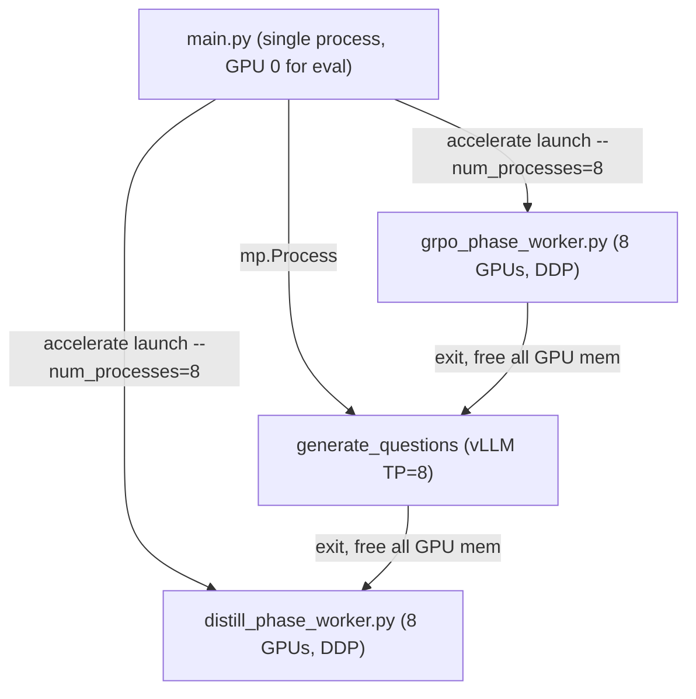

# Multi-GPU Support for `distill/main.py`

## Current Architecture (Single GPU)

`main.py` is a single-process orchestrator that spawns three subprocess phases per iteration:

1. **GRPO** (`grpo_phase_worker.py`) -- `subprocess.run([python, worker, manifest])`
2. **Question Gen** (`generate_questions.py`) -- `mp.Process` with vLLM
3. **Distillation** (`distill_phase_worker.py`) -- `subprocess.run([python, worker, manifest])`

Each subprocess gets a fresh CUDA context. Between phases, GPU memory is fully freed. The main process only touches the GPU for optional student evaluation.

## Strategy

- Launch training workers (GRPO, Distillation) via `**accelerate launch --num_processes=N`** instead of bare `python`. Both `GRPOTrainer` (TRL) and `DistilTrainer` already use `accelerator` internally and support multi-GPU out of the box.
- For question generation, pass `**tensor_parallel_size=N**` to vLLM's `LLM()` constructor so vLLM manages multi-GPU parallelism internally.
- Keep the main orchestrator as a single process (`python main.py`). Eval uses one GPU and the 7B model fits easily on a single H100.




## Memory Budget per GPU (DDP, 7B bf16)

With vLLM sleep mode enabled, memory is time-shared between generation and training/reward:

- **During training**: Model 14GB + AdamW-8bit optimizer ~7GB + vLLM colocate (0.3 * 80GB) ~24GB = ~45GB. Fits with headroom.
- **During GRPO reward** (vLLM asleep, ~0GB): Training model 14GB + student swap-in 14GB + judge swap-in 14GB + optimizer 7GB = ~49GB. Fits.
- With FSDP instead of DDP, the training model is sharded (14/8 ~2GB per GPU), giving even more headroom.

## Changes by File

### 1. `[distill/main.py](distill/main.py)` -- Orchestrator

- Add `--num_gpus` CLI argument (default `1` for backward compat).
- Replace bare `subprocess.run([sys.executable, worker, manifest])` calls with `accelerate launch`:

```python
cmd = [
    sys.executable, "-m", "accelerate.commands.launch",
    "--num_processes", str(args.num_gpus),
    "--mixed_precision", "bf16",
    worker_py, manifest_path,
]
subprocess.run(cmd, check=True)
```

- Pass `num_gpus` through to question generation so vLLM gets `tensor_parallel_size`.
- When `num_gpus > 1`, scale down `gradient_accumulation_steps` in the manifest configs to keep the effective batch size constant: `grpo_kw["gradient_accumulation_steps"] = args.gradient_accumulation_steps // args.num_gpus` (with a floor of 1).

### 2. `[distill/grpo_phase_worker.py](distill/grpo_phase_worker.py)` -- GRPO Worker

- **Remove unconditional `MASTER_PORT` override**. Change to only set these when not already provided by accelerate:

```python
if "MASTER_PORT" not in os.environ:
    os.environ["MASTER_ADDR"] = "127.0.0.1"
    os.environ["MASTER_PORT"] = str(_find_free_port())
```

- **Replace `model.save_pretrained()`** with `trainer.save_model(output_dir)` (handles DDP/FSDP unwrapping correctly). Guard tokenizer save with rank check:

```python
trainer.save_model(output_dir)
if int(os.environ.get("LOCAL_RANK", 0)) == 0:
    tokenizer.save_pretrained(output_dir)
```

- The reward function (`reward_question_difficulty`) works as-is in multi-GPU: each rank independently swaps student/judge to its own GPU for its local batch slice. Memory fits (see budget above).

### 3. `[distill/distill_phase_worker.py](distill/distill_phase_worker.py)` -- Distillation Worker

- Same `MASTER_PORT` fix as GRPO worker.
- **Remove `.to("cuda")`** on student model load -- accelerate handles device placement:

```python
student = AutoModelForCausalLM.from_pretrained(
    manifest["student_model_path"], torch_dtype=torch.bfloat16,
)  # no .to("cuda")
```

- Replace `student.save_pretrained(output_dir)` with `trainer.save_model(output_dir)` + rank-guarded tokenizer save.

### 4. `[data/generate_questions.py](data/generate_questions.py)` -- Question Generation

- Add `tensor_parallel_size` parameter to `generate_questions()` and `build_question_dataset()`, threaded through `_run_generate_questions()`.
- Pass it to vLLM:

```python
llm = LLM(
    ...,
    tensor_parallel_size=tensor_parallel_size,
)
```

- In `build_question_dataset`, the caller (`main.py`) passes `args.num_gpus` as `tensor_parallel_size`.

### 5. No Changes Needed

- `**distil_trainer.py**`: Already supports multi-GPU via `accelerator`, including FSDP param sync to vLLM.
- `**distil_config.py**`: No changes needed.
- `**eval/inference.py**`: Uses `model.device` for placement; works as-is.
- **Main process eval section** in `main.py`: Keeps using GPU 0, no changes.

## Hyperparameter Adjustments (User Responsibility)

When moving from 1 to 8 GPUs with DDP, the per-step global batch becomes 8x larger. To keep the same effective batch size:

- Divide `--gradient_accumulation_steps` by the GPU count (e.g., 32 -> 4).
- Or keep it the same to intentionally scale up the batch.

## Example Launch Command

```bash
python distill/main.py \
  --num_gpus 8 \
  --num_generation_iterations 3 \
  --num_question_generations 10 \
  --num_questions_per_generation 5 \
  --gradient_accumulation_steps 4 \
  --dataset_path ./data/wiki_20/data.json \
  --model_name allenai/OLMo-2-1124-7B-Instruct \
  --output_dir ./distill/out/grpo_distill
```

